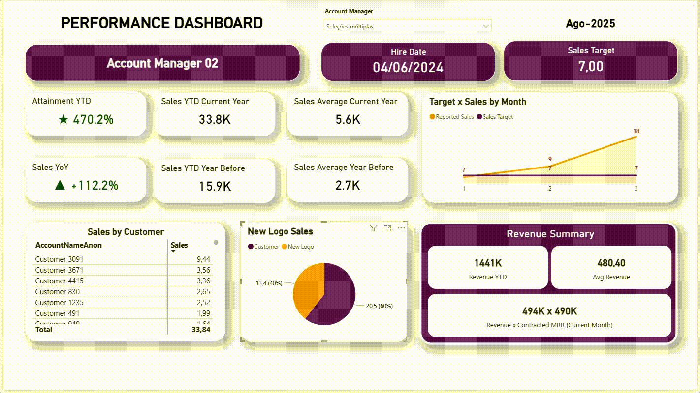
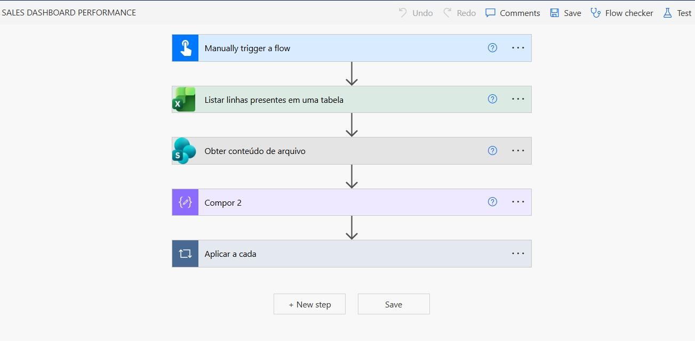

# Sales Performance Dashboard

## Project Overview
This project delivers a global Sales Performance Dashboard designed to serve as a recurring monthly reference for Account Managers, Sales Leadership, and Management.

The dashboard consolidates individual and overall sales performance into a single analytical view, with a strong focus on targets, revenue evolution, and metrics that directly impact commission and performance evaluation.

The solution was built for company-wide adoption at a global level, ensuring standardized KPIs, consistent definitions, and reliable performance comparisons across regions.

---

## Business Purpose
The main objectives of this project are to:
- Track sales performance against defined targets
- Monitor progress toward annual goals
- Enable transparent and consistent commission calculations
- Support recurring performance and coaching discussions
- Provide fast and reliable visibility for sales leadership

The dashboard acts as a trusted source of truth, reducing manual reporting and alignment discussions across the sales organization.

---

## Key Metrics and KPIs

### Core Performance Metrics
- Attainment YTD
- Sales YTD – Current Year
- Average Sales – Current Year
- Sales Year-over-Year (YoY)
- Sales YTD – Previous Year
- Average Sales – Previous Year

These indicators provide both absolute performance visibility and historical comparison context.

---

## Target vs Sales Analysis
A monthly comparison between targets and actual sales results highlights:
- Over- and under-performance trends
- Seasonality patterns
- Consistency of target attainment across the year

This view supports proactive performance management rather than purely retrospective analysis.

---

## Customer and Growth Analysis

### Sales by Customer
- Revenue breakdown by customer
- Visibility into customer concentration
- Support for portfolio balance evaluation

### New Logo Sales
- Revenue generated from new customers
- Clear separation between expansion and acquisition-driven growth

---

## Revenue and Commission Impact
The dashboard includes revenue metrics that directly impact sales commissions, ensuring:
- Transparency for Account Managers
- Alignment between reported performance and compensation
- Consistent calculation logic across all regions

This significantly reduces manual adjustments and commission-related disputes.

---

## Sales Performance Manager View

A dedicated Manager View tab provides a fast and consolidated overview of sales performance across all Account Managers.

This view includes:
- Ranking of all Account Managers
- Key performance indicators per individual
- Relative performance comparison across the sales team

It enables leadership to quickly identify top performers, understand performance distribution, and prioritize coaching or recognition actions without navigating multiple dashboard pages.

---

## Data Architecture and Sources
This project integrates data from multiple enterprise sources:
- Centralized Data Warehouse
- Direct connection to the official CRM system
- Internal datasets related to targets, revenue, and performance governance

All data is modeled using a star schema, ensuring performance, scalability, and consistent KPI calculations.

---

## Refresh Cycle and Automation
- Automatic monthly data refresh aligned with financial and performance cycles
- Refresh cadence designed to support:
  - Sales closing
  - Commission calculation
  - Executive reporting

After each refresh, an automated Power Automate workflow is triggered.

---

## Power Automate Integration

Power Automate is used to:
- Trigger report distribution after data refresh
- Send formatted, role-specific emails
- Ensure timely delivery of performance insights

---

## Automated Email Delivery

Sales performance results are delivered automatically to end users in a structured and readable email format, removing the need for manual follow-up or report navigation.

---

## Data Volume and PBIX Availability
Due to large data volumes, enterprise-grade architectures, and secure data sources, PBIX files are not shared in this repository.

Instead, the project is demonstrated using:
- Animated GIFs of dashboard operation
- Visual walkthroughs of Power Automate workflows
- Examples of automated email delivery

This approach reflects real-world BI environments without compromising performance or data privacy.

---

## Data Privacy
- All data shown is public, simulated, or fully anonymized
- Customer and Account Manager names are replaced with generic identifiers
- No real company, client, or confidential data is disclosed
- This project is not connected to any production environment

---

## Key Outcomes
- Clear and transparent visibility into sales performance
- Improved alignment between targets, results, and commissions
- Faster identification of top-performing Account Managers
- Reduced manual effort in recurring performance reviews
- Strong support for management decision-making
